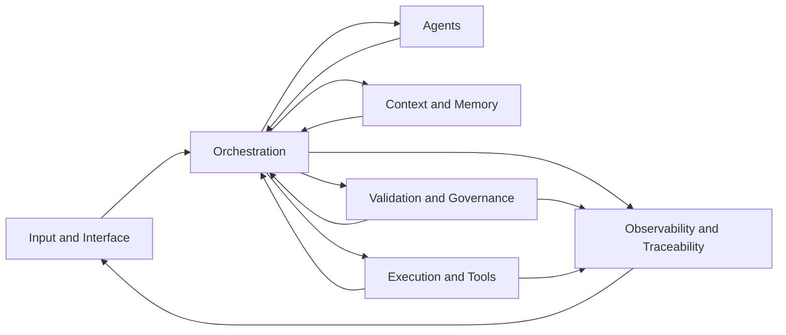
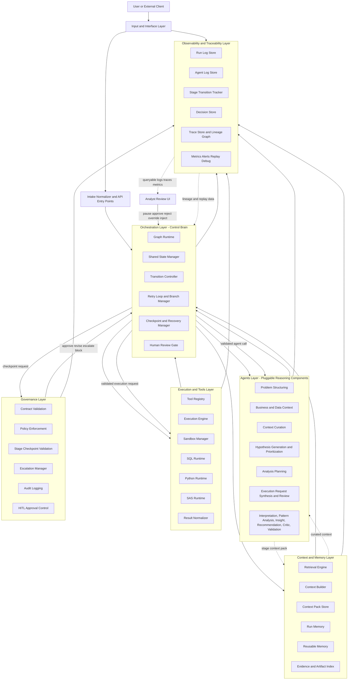

# ABA Architecture

This file is system-generated from intent and iteration workflow. Do not edit directly.

## Purpose

Agentic Business Analytics (ABA) is an enterprise-grade, agentic analytics system organized as a layered control plane. The architecture separates input handling, orchestration, reasoning, context management, execution, and governance so the system can operate with explicit control flow, structured contracts, and auditable outcomes.

## Architecture Principles

- The LangGraph orchestrator is the control brain for every run.
- Agents are pluggable reasoning components with bounded responsibilities.
- Context is a first-class system capability, not incidental prompt assembly.
- Tools are invoked only through the execution layer under policy control.
- Shared state is the canonical handoff between all nodes and services.
- Governance and observability apply across every layer and stage.

## Component Catalog

This table summarizes the seven primary implementation components and the ownership boundary for each one.

| Component | Purpose | Owns | Does not own | Primary code areas |
| --- | --- | --- | --- | --- |
| Input and Interface | Accept and normalize user-facing requests into governed run initiation | API entrypoints, lifecycle hooks, run creation, review and trace access, request normalization | Graph routing, agent reasoning, tool execution | `src/app/backend/` |
| Orchestration | Control the run lifecycle through LangGraph state, transitions, retries, and checkpoints | Graph definition, shared state, node execution, branching, rollback, HITL pauses | Business reasoning, tool runtime, persistence policy | `src/orchestrator/` |
| Agents | Produce bounded reasoning outputs for each stage | Problem framing, context curation, hypothesis generation, planning, execution interpretation, insight generation, critique | Control flow, direct tool execution, state mutation outside orchestrator writes | `src/agents/` |
| Context and Memory | Build stage-aware context packs and manage run-scoped reuse | Retrieval, selection, pruning, provenance, run memory, reusable memory policy | Orchestration, governance enforcement, tool dispatch | `src/context/` |
| Execution and Tools | Run approved analytical work through governed sandboxes | Tool registry, runtime adapters, sandbox execution, result normalization, execution metadata | Reasoning, stage control, user review policy | `src/execution/`, `src/tools/` |
| Validation and Governance | Enforce policy, checkpoints, confidence, escalation, and HITL control | Stage validation, policy checks, gate decisions, escalation, confidence rules, approval handling | Graph ownership, tool runtime, trace storage | `src/governance/` |
| Observability and Traceability | Capture structured evidence for inspection, replay, and audit | Logs, traces, lineage, metrics, event storage, artifact references | Decision ownership, control flow, business interpretation | `src/observability/` |

Supporting packages used across multiple components:

- `src/contracts/` for canonical request, response, state, validation, error, and trace schemas
- `src/shared/` for generic config, enums, constants, exceptions, and small utilities

## Component Interaction Model

This table defines the primary handoffs between the seven components. It captures who initiates the exchange, what crosses the boundary, and who owns the decision at that boundary.

| From | To | Trigger | Payload | Decision owner | Trace owner |
| --- | --- | --- | --- | --- | --- |
| Input and Interface | Orchestration | User request or API call is accepted | Normalized intake, attachments, caller metadata, initial constraints | Orchestration | Observability |
| Orchestration | Agents | A stage node needs bounded reasoning output | Shared state slice, stage context pack, agent-specific contract | Orchestration | Observability |
| Orchestration | Context and Memory | A node needs curated context | Retrieval request, stage scope, memory policy | Orchestration | Observability |
| Context and Memory | Orchestration | Context retrieval or memory assembly completes | Context pack, provenance, exclusions, memory signals | Orchestration | Observability |
| Orchestration | Validation and Governance | A stage output or transition must be checked | Stage output, state delta, policy context, checkpoint request | Validation and Governance | Observability |
| Validation and Governance | Orchestration | A checkpoint passes, blocks, retries, or escalates | Validation outcome, confidence, approval state, next action | Validation and Governance | Observability |
| Orchestration | Execution and Tools | An approved execution request is ready to run | Structured execution request, tool constraints, sandbox policy | Orchestration | Observability |
| Execution and Tools | Orchestration | Tool execution or dry-run completes | Normalized result bundle, logs, artifacts, error record | Orchestration | Observability |
| Orchestration | Observability and Traceability | A node transition, retry, branch, or checkpoint occurs | Structured event, state delta, artifact references | Orchestration | Observability |
| Observability and Traceability | Input and Interface | A user inspects runs, traces, or lineage | Query results, timeline, artifacts, drill-down links | Input and Interface | Observability |

## Layered Control Plane Model

### Input and Interface Layer

The Input and Interface Layer is responsible for accepting requests, normalizing them, and initiating governed ABA runs.

Primary responsibilities:

- accept user input from analyst workspace, chat-style request panels, form-based intake, and file upload surfaces
- ingest contextual assets such as documents, specifications, data dictionaries, run attachments, and prior analytical artifacts
- expose API entry points for application clients, automation triggers, and platform integrations
- normalize inbound payloads into a structured intake contract
- assign run identifiers, caller metadata, tenancy, permissions, and initial execution constraints
- reject malformed or unauthorized requests before graph execution begins

Core components:

- analyst workspace interface
- file and context ingestion service
- API gateway and request router
- intake normalizer
- identity, access, and tenancy adapter

Required outputs:

- normalized problem payload
- attached artifact references
- caller and environment metadata
- initial run state shell

### Orchestration Layer (LangGraph)

The Orchestration Layer is the LangGraph-driven control plane. It owns state transitions, control flow, retries, branching, and checkpoint management. No other layer is allowed to advance the lifecycle implicitly.

Primary responsibilities:

- maintain the canonical shared state object
- execute the analytics lifecycle as a graph of explicit nodes
- apply entry and exit rules for every node
- determine next-node transitions through branching logic
- manage bounded loops, retries, rollback, and convergence checks
- checkpoint major state transitions
- dispatch work to agents as controlled node actions
- invoke validation and policy gates before advancing the run
- pause, escalate, or terminate when governance conditions require it

Core components:

- graph runtime
- transition controller
- checkpoint manager
- retry and loop manager
- branching and convergence evaluator
- human review gate controller
- failure and recovery controller

Control boundaries:

- the orchestrator controls state transitions
- the orchestrator controls execution flow
- the orchestrator controls retries and branching
- agents do not chain themselves to other agents
- there is no implicit chaining between stages

Primary nodes:

- intake framing
- context assembly
- hypothesis generation
- hypothesis prioritization
- analysis planning
- execution request synthesis
- execution review and dispatch
- result interpretation
- pattern and driver analysis
- insight generation
- recommendation generation
- insight validation
- publish, pause, escalate, or terminate

### Agents Layer

The Agents Layer contains modular reasoning components. Each agent is independently pluggable, receives bounded inputs from shared state and a stage context pack, and returns only structured outputs.

Primary responsibilities:

- reason over curated context
- produce stage-specific decisions, proposals, rankings, critiques, or syntheses
- surface uncertainty, contradictions, and rationale in structured form
- recommend next actions to the orchestrator without controlling flow

Agent design rules:

- each agent is a pluggable component behind a stable contract
- each agent has a strict input schema and output schema
- agents do not share hidden logic or private side channels
- agents do not execute tools directly
- agents do not mutate shared state directly outside orchestrated writes

Core agent set:

- Intake Structuring Agent
  - input: normalized problem payload and intake metadata
  - output: machine-readable problem frame, assumptions, risks, open questions
- Business Context Agent
  - input: problem frame and business artifacts
  - output: business context slice and relevance annotations
- Data Context Agent
  - input: problem frame and available data metadata
  - output: data inventory, schema signals, quality risks, access constraints
- Context Curation Agent
  - input: retrieved business, data, memory, and policy context
  - output: stage-ready context pack with prioritization and exclusions
- Hypothesis Generation Agent
  - input: problem frame and context pack
  - output: candidate hypotheses with rationale and evidence needs
- Hypothesis Prioritization Agent
  - input: candidate hypotheses and ranking criteria
  - output: ranked, pruned, merged, or deferred hypothesis set
- Analysis Planning Agent
  - input: prioritized hypotheses and execution constraints
  - output: analytical plan, expected evidence, and required execution requests
- Execution Request Synthesis Agent
  - input: approved analysis plan and tool capabilities
  - output: structured execution requests for SQL, Python, or SAS
- Code Review Agent
  - input: structured execution requests and generated analytical logic
  - output: review findings, correction requests, and execution readiness decision
- Execution Interpretation Agent
  - input: normalized execution results and runtime metadata
  - output: result summary, anomalies, caveats, and follow-up questions
- Pattern and Driver Analysis Agent
  - input: execution findings and evidence map
  - output: root-cause candidates, segment patterns, and comparative drivers
- Insight Generation Agent
  - input: interpreted results, patterns, and evidence
  - output: insight pack with confidence, support, and contradictions
- Recommendation Agent
  - input: validated insights and business constraints
  - output: recommended actions, expected impact, and operational considerations
- Critic Agent
  - input: stage outputs and reasoning rationale
  - output: challenges, inconsistencies, and correction signals
- Insight Validation Agent
  - input: insight pack, recommendation pack, and evidence map
  - output: evidence sufficiency decision, confidence score, and release readiness

### Context and Memory Layer

The Context and Memory Layer manages retrieval, assembly, persistence, and reuse of information required for high-quality reasoning. This layer prevents prompt sprawl by producing bounded, stage-aware context packs.

Primary responsibilities:

- retrieve relevant business, data, policy, and historical context
- assemble minimal stage-specific context packs
- persist context packs for replay and audit
- maintain short-term run memory and reusable memory across runs
- preserve lineage between context sources and downstream outputs
- update context as state evolves across stages

Core components:

- retrieval engine
- context builder
- context pack store
- run memory store
- reusable memory store
- evidence and artifact index

Context flow model:

- the orchestrator requests retrieval for the current node
- the retrieval engine returns ranked candidate context items
- the context builder converts ranked items into a stage-aware context pack
- the context pack is attached to the shared state and passed into the target agent
- the agent emits new findings, unresolved questions, and evidence signals
- the orchestrator decides whether those outputs update run memory, reusable memory, or both
- later nodes receive refreshed context packs built from the latest approved state

Context categories:

- business context
- data context
- policy and governance context
- prior stage outputs
- historical analytical artifacts
- reusable memory from previous runs

Memory domains:

- run memory
  - ephemeral memory scoped to a single ABA run
  - stores checkpoints, node outputs, active hypotheses, intermediate evidence, and iteration history
- reusable memory
  - persistent memory shared across runs under access and quality controls
  - stores reusable analytical artifacts, prior context packs, validated insights, tool performance history, and known data semantics

### Execution and Tools Layer

The Execution and Tools Layer provides the only sanctioned path to tool usage. It abstracts runtime execution behind a registry-driven interface and returns standardized results to the orchestrator.

Primary responsibilities:

- expose a governed tool registry with metadata and policies
- select execution targets based on orchestrator-approved requests
- execute SQL, Python, and SAS in sandboxed runtimes
- capture inputs, outputs, logs, artifacts, timings, and failures
- normalize results into a common execution-result contract

Core components:

- tool registry
- execution engine
- sandbox manager
- runtime adapters for SQL, Python, and SAS
- artifact manager
- result normalizer

Tool registry contract:

- tool identifier and version
- supported task categories
- accepted input schema
- produced output schema
- execution constraints
- safety and policy tags
- runtime requirements
- cost, latency, and reliability metadata
- fallback options

Execution model:

- an agent produces a structured execution request through its output contract
- the orchestrator validates the request and selects an approved tool path
- the execution engine runs the request in a sandboxed runtime
- the runtime adapter captures raw outputs and artifacts
- the result normalizer returns a standardized execution-result bundle to shared state

Standardized execution-result bundle:

- request identifier
- tool identifier and version
- runtime environment metadata
- normalized tabular or artifact outputs
- log summary
- warnings and policy notes
- structured error record when applicable
- reproducibility metadata

### Governance and Observability Layer

The Governance and Observability Layer is cross-cutting across all other layers. It is embedded at runtime around the orchestrator, surrounds all stage transitions, and ensures policy enforcement, validation, logging, lineage, replayability, and auditability from intake through final insight.

Primary responsibilities:

- validate contracts, stage outputs, and transition readiness
- enforce safety, compliance, data, and release policies
- capture structured run logs, agent logs, stage transitions, and decision records
- maintain traceability from user intake to insight and recommendation
- record retry patterns, latency, execution metrics, and failure modes
- support audit, debugging, replay, and evaluation workflows

Core components:

- contract validation service
- policy engine
- stage checkpoint validator
- escalation manager
- audit log and event stream
- observability pipeline
- trace store
- decision store
- lineage graph
- metrics and alerting service
- replay and debugging interface

Governance controls:

- input validation gates
- state schema validation
- hypothesis quality checks
- plan feasibility and policy checks
- execution safety review
- result integrity checks
- insight evidence validation
- escalation and human intervention triggers

Runtime governance model:

- governance sits beside the LangGraph orchestrator as a mandatory runtime control service
- every node entry and node exit passes through validation and policy checks before transition
- agents submit structured outputs to the orchestrator, and governance evaluates those outputs before they are committed into shared state
- the orchestrator cannot advance to the next node until governance returns one of: approved, revise, retry, escalate, or blocked
- escalation triggers include low confidence, unresolved contradictions, policy violations, weak evidence, repeated validation failure, unsafe execution intent, and missing human approval where required

Stage checkpoint model:

- intake checkpoint validates completeness, ambiguity flags, and scope consistency
- context checkpoint validates relevance, freshness, provenance, and sufficiency
- hypothesis checkpoint validates testability, duplication, contradiction handling, and ranking rationale
- plan checkpoint validates feasibility, tool appropriateness, cost, policy conformance, and expected evidence
- execution checkpoint validates sandbox settings, data access scope, code safety, and result integrity
- insight checkpoint validates evidence linkage, confidence, contradiction handling, and recommendation support

### Observability Architecture

Observability remains a dedicated architecture within the cross-cutting layer and is not merged into orchestration or execution services.

Primary observability components:

- run log store
- agent log store
- stage transition tracker
- performance metrics collector
- structured event bus
- query and inspection interface

Observability outputs:

- run-level logs for intake, checkpoints, transitions, execution, escalation, and termination
- agent-level logs for inputs received, outputs produced, reasoning metadata, uncertainty signals, and validation outcomes
- stage transition records for node enter, node exit, branch selection, retry, rollback, and pause events
- performance metrics for latency, retries, token usage, tool runtime, queue delay, and resource consumption

Observability rules:

- all logs are structured and schema-bound
- all logs are queryable by run, stage, agent, tool, hypothesis, insight, or error code
- state deltas, decisions, and failures emit correlated event identifiers
- observability data is retained with replay-safe references to state snapshots and artifacts

### Traceability and Lineage Architecture

Traceability is implemented as a lineage graph plus immutable trace records linked to shared state checkpoints.

Lineage chain:

- intake
- context
- hypothesis
- plan
- execution
- insight

Traceability rules:

- each node writes trace data at entry, exit, and transition time
- each stage output links to its source inputs, context pack version, governing decision, and supporting evidence
- each hypothesis carries lineage to the problem frame, context sources, ranking decision, and collected evidence
- each plan links to selected hypotheses, rejected alternatives, required tools, and approval state
- each execution record links to the plan item, execution request, runtime environment, accessed data scope, and produced artifacts
- each insight links to execution outputs, evidence map, contradictions, confidence signals, and recommendation dependencies

### Decision Logging Architecture

The decision store captures why the system chose one path over another so no critical reasoning step remains a black box.

Decision store contents:

- why a hypothesis was selected, ranked down, merged, or pruned
- why a plan was chosen, revised, or rejected
- why a branch, retry, rollback, or escalation occurred
- why an insight was generated, withheld, or downgraded in confidence
- why a recommendation was approved or blocked

Decision record fields:

- decision identifier
- decision type
- deciding node and actor
- input references
- considered alternatives
- rationale summary
- policy and validation outcomes
- confidence score
- resulting action
- linked evidence and checkpoint references

### Replay and Debugging Architecture

Replay and debugging are built on top of checkpointed shared state, trace storage, structured logs, and immutable decision records.

Replay capabilities:

- replay a full run from intake through finalization
- replay from any stable checkpoint
- inspect step-level inputs, outputs, validations, and state deltas
- compare original and replayed outcomes under the same or updated policies

Debugging capabilities:

- inspect failed node transitions and blocking governance decisions
- inspect agent inputs, outputs, and returned uncertainty signals
- inspect execution requests, runtime logs, artifacts, and structured error records
- inspect branch selection, retry counts, fallback selection, and rollback history

Replay and debugging requirements:

- trace storage preserves event order, correlation identifiers, and checkpoint references
- step-level inspection is available for every node, agent invocation, tool execution, and human intervention
- failed runs retain enough state to reproduce root-cause analysis without relying on raw prompts alone

### Human-in-the-Loop Control Architecture

Human-in-the-loop control is an explicit architectural path between the analyst interface and the orchestrator. Human actions are first-class runtime events recorded in shared state, the audit log, and the decision store.

HITL checkpoints:

- intake clarification approval
- hypothesis shortlist approval or override
- plan approval before critical execution
- insight approval, rejection, or revision request
- escalation review for contradictory or low-confidence outcomes

HITL interaction model:

- the user interface sends pause, approve, reject, override, or inject-input actions to the orchestrator
- the orchestrator places the run into a review state at approved checkpoints or escalation-triggered pauses
- governance validates the human action against role, policy, and state consistency rules before committing it
- the orchestrator resumes the graph only after the human event is recorded as an explicit transition

Human actions supported:

- pause flow
- resume flow
- override decisions
- inject corrected inputs
- approve or reject stage outputs
- request deeper analysis

### Security and Execution Control Architecture

Security and execution control are enforced through the execution layer and governance layer together.

Security controls:

- sandboxed execution for SQL, Python, and SAS runtimes
- data access control boundaries tied to tenant, role, and run scope
- safe tool invocation through allowlisted registry entries only
- least-privilege credentials for execution adapters
- runtime isolation, resource quotas, and network restrictions where applicable
- dry-run and preflight validation for sensitive execution requests

Execution safety rules:

- agents cannot invoke tools directly
- every execution request is schema validated and policy checked before dispatch
- data access is constrained to approved datasets, schemas, and operations
- unsafe operations are blocked or escalated before runtime execution

### Failure and Resilience Architecture

Failure handling is controlled by the orchestrator and recorded by governance and observability services.

Resilience mechanisms:

- bounded retry strategies per node and per tool
- fallback tool or plan selection when the primary path fails
- rollback to the last stable checkpoint
- partial execution handling with structured partial-success contracts
- graceful degradation when evidence is incomplete or execution is unavailable

Failure control rules:

- retries are stage-specific and budgeted
- repeated failures trigger escalation or branch termination rather than silent looping
- partial outputs remain explicitly labeled and cannot be promoted as final insights without validation
- contradictions and low-confidence results force revision, deeper analysis, or human review

## Detailed Architecture Diagram

## Shared State Model

The shared state object is the canonical state carrier across the graph. All nodes read from this object, and only the orchestrator commits validated updates back into it.

Required state domains:

- run metadata
  - run identifier, contract version, timestamps, actor, tenant, environment, status
- intake payload
  - normalized problem statement, attachments, user preferences, access scope
- problem frame
  - objectives, analytical questions, constraints, assumptions, open issues
- context state
  - active context pack, context source references, pack version, exclusions
- hypothesis state
  - hypothesis objects, ranks, lifecycle status, lineage, evidence needs
- plan state
  - candidate analyses, required tools, feasibility, approval status
- execution state
  - execution requests, dispatch status, runtime metadata, result references
- evidence state
  - evidence map, supporting artifacts, contradictions, confidence drivers
- insight state
  - findings, recommendations, approvals, release status
- governance state
  - policy decisions, validation outcomes, escalation flags, review actions
- decision state
  - decision identifiers, rationale summaries, alternatives considered, linked evidence, human overrides
- control state
  - current node, next candidate nodes, retry counts, loop counters, checkpoints
- observability state
  - trace identifiers, event references, run logs, agent logs, transition logs, metrics, audit links

State management rules:

- all state updates are schema validated
- every major node exit creates a checkpoint
- failed transitions write structured error state rather than partial free-form text
- node outputs are immutable once checkpointed; later corrections are additive revisions
- state mutations are attributable to a node, agent, or system service
- each committed state update emits structured trace and decision events

## Node and Data Flow

### Input to intake framing

- the Input and Interface Layer produces a normalized intake payload
- the orchestrator initializes shared state and enters the intake framing node
- the Intake Structuring Agent returns a structured problem frame
- governance validates the frame, records the checkpoint, and confirms the frame is usable or routes to clarification

### Intake framing to context assembly

- the orchestrator requests candidate context based on the problem frame
- the retrieval engine ranks business, data, policy, and memory assets
- the context builder creates a stage-specific context pack
- the Context Curation Agent refines pack relevance and exclusions
- governance checks context provenance, sufficiency, and freshness before the orchestrator writes the approved context pack into shared state

### Context assembly to hypothesis management

- the Hypothesis Generation Agent receives the approved context pack
- the Hypothesis Prioritization Agent ranks, merges, or prunes hypotheses
- governance records why hypotheses were selected or rejected, and the orchestrator decides whether to branch, iterate, or continue based on viability, contradictions, confidence, and depth rules

### Hypothesis management to planning

- the Analysis Planning Agent converts prioritized hypotheses into executable analytical plans
- the Critic Agent or validation service can return the plan for revision
- the orchestrator advances only when plan completeness, feasibility, policy checks, and approval requirements pass

### Planning to execution

- the Execution Request Synthesis Agent emits structured execution requests
- the Code Review Agent evaluates correctness and readiness
- governance verifies safe invocation, data access boundaries, and sandbox policy before the orchestrator dispatches approved requests to the execution engine
- the execution engine runs tools in sandboxed runtimes and returns normalized results

### Execution to insight generation

- the Execution Interpretation Agent converts raw results into analytical signals
- the Pattern and Driver Analysis Agent expands root-cause and segmentation reasoning
- the Insight Generation Agent produces insight candidates
- the Recommendation Agent proposes actions tied to validated evidence
- the Insight Validation Agent checks evidence sufficiency and confidence, and governance may escalate low-confidence or contradictory outcomes to HITL review

### Finalization and loop-back

- the orchestrator may finalize, branch to deeper analysis, retry a failed node, or roll back to a stable checkpoint
- all loop-backs are explicit state transitions governed by retry budgets, convergence criteria, fallback rules, and policy controls

## Integration Boundaries

### Interface to orchestrator contract

- requests enter as normalized intake payloads only
- no downstream layer receives raw interface payloads directly

### Orchestrator to agent contract

- orchestrator provides node-specific state slice, context pack, and contract version
- agent returns structured output, rationale, uncertainty signals, and requested next actions

### Orchestrator to execution contract

- orchestrator sends validated execution requests with runtime policy context
- execution layer returns normalized result bundles and structured errors

### Context to agent contract

- agents receive only the current stage context pack, not unrestricted system memory
- context packs carry provenance, freshness, and relevance metadata

### Governance contract

- every layer emits auditable events and validates against active policy rules
- no stage can bypass contract validation or policy checks

### Observability contract

- every run, agent call, stage transition, human action, and tool execution emits structured, queryable telemetry
- observability artifacts are correlated by run identifier, checkpoint identifier, and decision identifier

### Traceability contract

- outputs must link to inputs, context versions, decision records, and evidence references
- lineage from intake to insight must be reconstructable without inference

## Enterprise Architecture Outcomes

This architecture provides:

- explicit separation of reasoning, control, context, execution, and governance
- deterministic control over branching, retries, and lifecycle progression
- pluggable agent composition with stable contracts
- governed tool execution through a registry and sandboxed runtime
- stage-aware context assembly with reusable memory under control
- full traceability from input to evidence-backed insight
